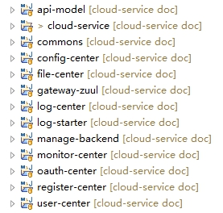

# **一、** ***\*环境\*******\*要求\****

## **1.** ***\*J\*******\*dk\****

要求1.8，因为用到了lambda表达式

## **2.** ***\*M\*******\*ysql\****

5.6或者以上

## **3.** ***\*Redis\****

3.0以上即可

下载地址

redis

https://github.com/MicrosoftArchive/redis/releases

 

Redis Desktop Manager

https://redisdesktop.com/download

 

注意：如果是非本地redis，即redis在别的机器上，那么请注意检查能否远程访问

## **4.** ***\*Rabbitmq\****

版本别太低就行

要记得先创建mq用户，见视频01.7 rabbitmq控制台添加用户

## **5.** ***\*Elasticsearch\****

日志中心使用，默认日志是存到mysql里，如采用默认配置，可不需要elasticsearch

# **二、** ***\*配置\*******\*host\****

***\*喜欢用\*******\*ip\*******\*地址\*******\*的同志忽略本节，跳过。\****

配置了host之后，我们程序里要用ip的就都用域名访问了，比如连接mysql，我们要用localhost或者127.0.0.1或者某个ip，配置了host之后，就可以用域名了，如：

## **1.** ***\*W\*******\*indows系统\*******\*配置host\****

C:\Windows\System32\drivers\etc

hosts文件

 

添加如下host配置

127.0.0.1 api.gateway.com #外网网关ip

127.0.0.1 local.gateway.com #内网网关ip

127.0.0.1 local.register.com #注册中心ip

127.0.0.1 local.monitor.com #监控中心ip

127.0.0.1 local.mysql.com #数据库ip

127.0.0.1 local.redis.com #redis ip

127.0.0.1 local.rabbitmq.com #rabbitmq ip

 

有部分win10系统的同志反映，用host连接redis、mysql啥的代码报错，说连不上，百度了下，win10系统可能需要打开cmd，然后执行下面的命令，清除DNS缓存

ipconfig /flushdns

再连不上的话，就只能改为用ip了

用ip也挺好，我们用host是因为环境多了的话，用host的字母能很容易的区分出来是什么配置

## **2.** ***\*Mac配置host\****

小威老师不会用苹果电脑，请你高抬贵手，打开百度，在搜索框输入***\*mac配置host\****，点击百度一下，找到方法后，将上文windows方法里的ip等粘进去即可。

 

## **3.** ***\*说明\*******\*：\****

本例子host配置的都是127.0.0.1，具体ip个人根据实际情况修改。其中local开头的我们是模拟内网环境，部署在网络相同的内网即可。

# **三、** ***\*工具\*******\*要求\****

## **1.** ***\*E\*******\*clise\*******\*和idea都行\****

是标准maven项目

## **2.** ***\*Lombok\****

***\*必须\*******\*安装lombok否则代码会编译不通过\****，安装方法自行百度，能力不足者，联系小威老师可适当远程帮助您。

# **四、** ***\*导入\****

## **3.** ***\*E\*******\*clipse\*******\*导入\****

右键Import

 

点击next，浏览目录

 

点击完成，等待maven下载相关依赖jar包。

如有大量报错，首先检查是否因为缺少get、set方法，如是，请看目录第三章，第2节Lombok

 

## **4.** ***\*I\*******\*dea\*******\*导入\****

 

下一步，浏览，找到相应文件夹，

 

这里选择Maven

 

按下图进行勾选

 

 

 

 

 

点击finish完成

如有大量报错，首先检查是否因为缺少get、set方法，如是，请看目录第三章，第2节Lombok

# **五、** ***\*数据库\*******\*初始化\****

这里为了例子和项目更能说明服务化，每个服务都有单独的数据库

## **1.** ***\*建库\****

如下，字符集最好为utf8mb4

 

库名分别为：

## **2.** ***\*脚本\****

分别在下图，sql的文件名及为库名

***\*用户\*******\*中心\****

 

***\*认证\*******\*中心\****

 

***\*文件\*******\*中心\****

 

***\*后台管理\****

 

***\*日志\*******\*中心\****

 

***\*通知\*******\*中心\****

 

# **六、** ***\*修改\*******\*配置\****

|      | ***\*工程名\****    |          |
| ---- | ------------------- | -------- |
| 1    | config-center       | 配置中心 |
| 2    | file-center         | 文件中心 |
| 3    | gateway-zuul        | 网关     |
| 4    | log-center          | 日志中心 |
| 5    | manage-backend      | 管理后台 |
| 6    | monitor-center      | 监控中心 |
| 7    | oauth-center        | 认证中心 |
| 8    | register-center     | 注册中心 |
| 9    | user-center         | 用户中心 |
| 10   | notification-center | 通知中心 |

 

## **1.** ***\*注册\*******\*中心地址\****

在上表9个工程里的bootstrap.yml中

 

如果配置了host的话，不需要改动，如果用ip的话，把local.register.com改为您的注册中心的ip

## **2.** ***\*数据库\*******\*配置\****

 

除了红色的未涉及数据库，其余6个配置里都有数据库的配置，如

 

如果配置了host，库名也按照上一章节的创建的话，只需修改端口号，用户名和密码，否则也要将域名改成ip

## **3.** ***\*R\*******\*edis\*******\*配置\****

目前

oauth-center.yml

notification-center.yml

user-center.yml用到了redis

 

 

将配置按实际情况修改即可，***\*如有密码\*******\*，跟host同\*******\*层\*******\*加password即可，别忘了冒号后有个空格\****，如果不是本地的redis，请检查是否允许远程访问

## **4.** ***\*R\*******\*abbitmq\*******\*配置\****

要记得先创建mq用户，见视频01.7 rabbitmq控制台添加用户，如下图， 

 

 

上图除去标红的外，都有mq配置，如与视频不同，***\*以文档为准\****

 

将配置按实际情况修改即可

## **5.** ***\*用户\*******\*认证url\*******\*修改\****

 

上图除去标红的外，都有获取用户认证信息的url

 

url域名和端口是网关中心的ip和端口，***\*这里demo是单个网关服务，正式生产或者多个网关服务的话，这里配置的是nginx的地址，注意该地址是各服务间在内网的调用，请配置\*******\*内网\*******\*的地址\****

## **6.** ***\*文件\*******\*中心配置修改\****

 

***\*本地存储文件\****

 

path是存储文件的路径，上图是windows的目录，mac或者linux根据情况设置绝对目录

urlPrefix前缀也是网关对外的域名和端口

***\*阿里云存储\****

 

这里需要配置你的阿里云对象存储OSS相关信息，详细根据视频目录看下视频

## **7.** ***\*后台\*******\*管理界面配置接口地址\****

 

这里定义了常量

domainName是后端接口地址

我们这里demo由于是直接访问网关的，所以配置的是后端java服务网关层的域名和端口，如没配置host的话，用ip加端口

 

该地址如果配置错误的话，我们的前端将访问不到后端接口

***\*注意：\*******\*正式生产为了保证网关的高可用性，肯定是部署了多个网关服务，然后用\*******\*nginx反向代理的\*******\*，那么多个网关或者生产环境的话，我们这里配置的是\*******\*nginx的地址\****

loginPage是登陆页地址，主要是为了未登录或过期时进行跳转，默认不需要修改

 

如果是前端单独部署的话，这里请写全路径，如http://xx.xx.xx/login.html， 

## **8.** ***\*邮件\*******\*配置\****

 

如果不使用发邮件功能，不用修改配置，也不用修改代码，别发邮件就行。

如果要用发邮件功能的话，需要配置您的邮箱信息，并将最后两行的注释打开，如下图

 

需要您开通smtp协议，如163邮箱：

http://help.163.com/10/0312/13/61J0LI3200752CLQ.html

## **9.** ***\*阿里云\*******\*短信配置\****

 

如要发短信，请配置您的阿里云信息

 

## **10.** ***\*日志\*******\*中心elasticsearch\****

 

默认使用实现类LogServiceImpl，日志是存储到mysql里的，

如想存储到elasticsearch的话，

注释掉LogServiceImpl上的@Primary和@Service

或者将@Primary***\*移到\****EsLogServiceImpl上面

 

配置上你自己的Elasticsearch环境信息

## **11.** ***\*微信授权相关\****

***\*这章节，不用微信授权的可忽略\*******\*，详细可看下视频\****

在用户中心user-center.yml

 

这里配置了服务端域名和用户中心转发规则（域名要跟微信网页授权域名一致），appid和secret根据实际情况配置即可，这里的例子配置了多个，只是为了说明咱们系统是可以支持多个的，其中app1、app2可随意定，不要重复即可，在

cloud-service\manage-backend\src\main\resources\static\pages\wechat\index.html

里

这个的跳去授权里，用到我们定义的app1

# **七、** ***\*启动\****

在redis、mysql、rabbitmq都启动的前提下，

都是spring boot项目，对着项目的根目录的类，启动main方法

## **1.** ***\*第一步启动\*******\*注册中心\****

 

## **2.** ***\*第二步启动\*******\*配置中心\****

 

## **3.** ***\*第三步\****

等待配置中心启动成功一会儿之后，再启动别的服务，否则微服务将拉取不到配置中心的配置，启动将报错。

用户中心、通知中心、授权中心、文件服务、日志中心、后台管理、监控，最后启动zuul网关

## **4.** ***\*535错误\****

在idea中启动manage-backend服务时，邮箱配置错误的话，会报535的错误，不影响系统启动，只是邮件发不出去而已。

 

 

都启动成功之后，可以访问后台管理界面

http://localhost:8080/api-b/login.html

用户名admin 密码admin

用户名superadmin 密码superadmin

 

 

 

 

 

 