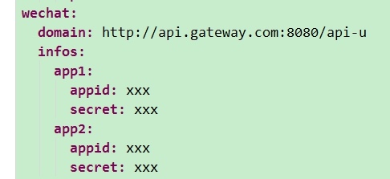
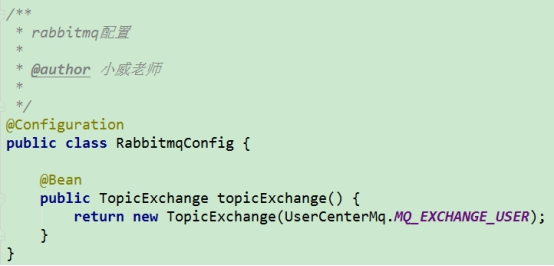
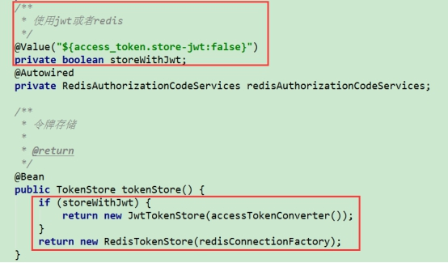
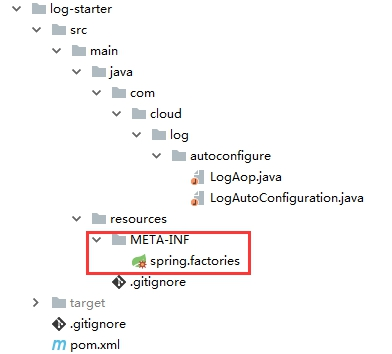
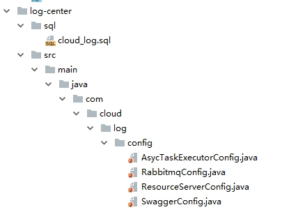

# **一、** ***\*项目结构\****

导入项目后，在eclipse和idea下展示如下：

## **1.** ***\*E\*******\*clipse\*******\*中\****

 

父pom在cloud-service中，文档也在cloud-service中，展开如下

 

## **2.** ***\*I\*******\*dea\*******\*中\****

父pom已全部展开

 

 

# **二、** ***\*模块和\*******\*配置\****

| ***\*工程名\**** | ***\*说明\****                       |
| ---------------- | ------------------------------------ |
| api-model        | 数据传输对象、常量等                 |
| commons          | 工具类、公共常量等                   |
| config-center    | 配置中心                             |
| file-center      | 文件中心                             |
| gateway-zuul     | 网关                                 |
| log-center       | 日志中心                             |
| log-starter      | 日志组件，别的项目直接引入该依赖即可 |
| manage-backend   | 后台管理                             |
| monitor-center   | 监控中心                             |
| oauth-center     | 认证中心                             |
| register-center  | 注册中心                             |
| user-center      | 用户中心、用户、角色、权限           |

 

## **1.** ***\*父\*******\*pom.xml\****

 

这里配置的各个模块目录

 

这里定义了一些jar包的版本号

 

## **2.** ***\*注册\*******\*中心\****

 

### **1)** ***\*b\*******\*ootstrap\*******\*.yml\****

意思是给该应用起个名字

应用启动后的端口号

### **2)** ***\*启动\*******\*注册中心\****

直接运行下面类的main方法

[com](eclipse-javadoc:☂=register-center/src\/main\/java.[cloud](eclipse-javadoc:☂=register-center/src\/main\/java.[register](eclipse-javadoc:☂=register-center/src\/main\/java.RegisterCenterApplication

### **3)** ***\*访问\*******\*http://localhost:8761\****

8761是bootstrap.yml里配置的系统端口号

 

Application列下的，REGISTER-CENTER就是我们在bootstrap.yml里指定的应用名，注册中心给我们大写处理了。

Status下显示的是我们在bootstrap.yml里的instance-id，如下图，我们这里是应用名加端口号

该配置为true的话，是用ip注册，否则是主机名注册，强烈建议配置为true

点击这里会跳转到类似如下的地址http://192.168.0.111:8761/info

用这种方式，我们可以看到服务的具体ip地址和端口

 

## **3.** ***\*配置\*******\*中心\****

 

### **1)** ***\*b\*******\*ootstrap\*******\*.yml\****

配置在本地或者git

 

通过spring.profiles.active这里可以指定配置文件在本地，还是classpath下还是在远程git上面，这里默认是放在了本地的classpath下，这里可根据实际项目需求和运维条件进行合理的选择配置方式。

### **2)** ***\*{\*******\*profile\*******\*}\****

上图配置中的{profile}，是由别的微服务指定的，如用户中心指定配置，用户中心里会有如下配置，

 

这里的profile: dev就会注入到

配置目录就成了classpath:/configs/dev

用户中心启动的时候，就会从配置中心拉取配置，目录就是

classpath:/configs/dev/user-center.yml

因此用户中心通过配置test或者production等等自定义的字符串，启动时会去找相应的配置，来达到分环境配置的目的，如

 

### **3)** ***\*端口\****

这里配置成0，启动时，项目会随机一个端口号

### **4)** ***\*注册\*******\*到注册中心\****

 

这里需要注意，地址后面有个/eureka/

如果是多注册中心，那么通过逗号分隔

 

### **5)** ***\*注册\*******\*中心里的显示\****

 

因为我们是随机端口号，我们这里用了随机数字来显示

 

注意那个随机数字，并不是真正的端口号，点击跳转之后

http://192.168.0.104:53484/info

这里我们才能看到真正的端口号

 

## **4.** ***\*用户\*******\*中心\****

 

### **1)** ***\*数据库\*******\*脚本\****

在user-center模块下的sql文件夹下cloud_user.sql里是用户中心的数据脚本，包含建表语句和初始化数据。

### **2)** ***\*b\*******\*ootstrap\*******\*.yml\****

 

这里主要配置，配置中心的serviceId就是配置中心的spring.application.name，还有自己的profile，还有注册中心的url

### **3)** ***\*user-center.yml\****

这里配置了用户系统具体的一些配置，比如数据库、mq、mybatis、日志级别等。

#### **a)** ***\*日志\*******\*级别和文件配置\****

 

#### **b)** ***\*数据源\*******\*配置\****

 

#### **c)** ***\*R\*******\*abbitmq\*******\*配置\****

 

#### **d)** ***\*M\*******\*ybatis\*******\*配置\****

 

别名包有多个的话，逗号隔开，如下图

 

复杂sql写在mapper.xml文件里，在下图路径下

 

#### **e)** ***\*微信公众号配置\****

 

详细看下代码com.cloud.user.service.impl.WechatServiceImpl和

cloud-service\manage-backend\src\main\resources\static\pages\wechat\index.html

 

### **4)** ***\*配置\*******\*类\****

 

#### **a)** ***\*全局\*******\*异常处理\****

 

抛出[java](eclipse-javadoc:☂=user-center/D:\/Program Files\/Java\/jdk1.8.0_112\/jre\/lib\/rt.jar.[lang](eclipse-javadoc:☂=user-center/D:\/Program Files\/Java\/jdk1.8.0_112\/jre\/lib\/rt.jar.IllegalArgumentException异常的接口将返回http状态码400

#### **b)** ***\*R\*******\*abbitmq的\*******\*exchange声明\****

 

这里声明一个topic类型的exchange，发消息时用。

#### **c)** ***\*资源\*******\*权限配置\****

 

将我们的项目作为资源服务器

是启动权限注解支持

 

这里符合规则的url将不做权限拦截。

#### **d)** ***\*密码\*******\*加密处理器\****

上图的

声明一个密码加密和校验处理器Bean，该bean是spring security自带的。

 

## **5.** ***\*认证\*******\*中心\****

 

### **1)** ***\*数据库\*******\*脚本\****

在oauth-center模块下的sql文件夹下cloud_oauth.sql里是认证中心的数据脚本，包含建表语句和初始化数据。

### **2)** ***\*b\*******\*ootstrap\*******\*.yml\****

除spring.application.name是oauth-center外，其他如用户中心的bootstrap.yml相同

### **3)** ***\*o\*******\*auth\*******\*-center.yml\****

#### **a)** ***\*redis配置\****

 

如redis有密码，与host同层级加节点password，如

 

注意password冒号后加一个空格

#### **b)** ***\*数据库\*******\*配置\****

 

#### **c)** ***\*token\*******\*是否用\*******\*jwt\****

 

false的话token是默认的uuid，true的话token将采用jwt

[com](eclipse-javadoc:☂=oauth-center/src\/main\/java.[cloud](eclipse-javadoc:☂=oauth-center/src\/main\/java.[oauth](eclipse-javadoc:☂=oauth-center/src\/main\/java.[config](eclipse-javadoc:☂=oauth-center/src\/main\/java.AuthorizationServerConfig里面

 

 

使用jwt时，需要配置这个签名key，具体可看下

[com](eclipse-javadoc:☂=oauth-center/src\/main\/java.[cloud](eclipse-javadoc:☂=oauth-center/src\/main\/java.[oauth](eclipse-javadoc:☂=oauth-center/src\/main\/java.[config](eclipse-javadoc:☂=oauth-center/src\/main\/java.AuthorizationServerConfig里面的

 

### **4)** ***\*配置\*******\*类\****

 

#### **a)** ***\*授权\*******\*服务器配置\****

 

#### **b)** ***\*资源\*******\*服务器\****

 

#### **c)** ***\*S\*******\*ession\*******\*共享配置\****

 

用redis做session共享，在授权码模式下，可能会涉及参数code和state和redirect_url的传递，多台服务器下需要共享session。

目前该项目没用授权码模式，此处不设置也没问题。

 

## **6.** ***\*文件\*******\*中心\****

 

bootstrap.yml里spring.application.name为file-center其余跟用户中心的一样

### **1)** ***\*file\*******\*-center.yml\****

#### **a)** ***\*数据库\*******\*和mq\****

 

#### **b)** ***\*上传\*******\*文件\*******\*大小\*******\*限制\****

 

#### **c)** ***\*自定义\*******\*配置\*******\*-本地存储文件\****

 

上图path是上传文件存储根路径

上图prefix是前缀

上图urlPrefix是域名加前缀

如d:/localFile/aaa.png用url访问就是

http://api.gateway.com:8080/api-f/statics/aaa.png

#### **d)** ***\*阿里云存储文件\****

 

如要上传图片到阿里云，这里需要配置你的阿里云对象存储OSS相关配置，详细根据视频目录看下视频。

### **2)** ***\*配置\*******\*类\****

#### **a)** ***\*加载\*******\*jar包外文件\****

 

上传文件存储路径肯定是在jar包外部的，这里不像传统war包是解压成文件夹的，因此这里要做个静态资源的映射处理。

 

这里将url前缀和存储路径做了个映射

#### **b)** ***\*资源\*******\*服务器\****

 

这里要将静态资源下的路径放开权限

 

 

 

## **7.** ***\*网关\****

 

bootstrap.yml里spring.application.name为gateway-zuul其余跟用户中心的一样

### **1)** ***\*gateway-zuul.yml\****

#### **a)** ***\*路由\*******\*规则\****

 

***\*sensitiveHeaders\****过滤客户端附带的headers，如：

sensitiveHeaders: X-ABC
如果在发请求时带了X-ABC，那么X-ABC不会往下游服务传递。

#### **b)** ***\*自定义\*******\*参数\****

 

这里有个cron定时任务表达式，每5分钟执行一次，

[com](eclipse-javadoc:☂=gateway-zuul/src\/main\/java.[cloud](eclipse-javadoc:☂=gateway-zuul/src\/main\/java.[gateway](eclipse-javadoc:☂=gateway-zuul/src\/main\/java.[filter](eclipse-javadoc:☂=gateway-zuul/src\/main\/java.BlackIPAccessFilter

 

 

### **2)** ***\*配置类\****

 

#### **a)** ***\*跨域\*******\*配置\****

 

只需要在网关层配置，别的微服务不需要配置跨域

#### **b)** ***\*异常\*******\*处理\****

 

这里主要处理FeignException，这个是feignclient调用时的异常，不处理的话将会抛出500服务端异常，这里只是将下游服务的原始http状态码还原。

 

## **8.** ***\*日志\*******\*组件\*******\*log\*******\*-starter\****

 

这里是模仿spring boot自动配置写的一个组件，就像spring boot里的各种starter，如

 

你只需要引入mybatis的starter，和数据源的配置，就可以用mybatis了。

 

### **1)** ***\*spring.factories\****

 

这里配置自动配置的类

### **2)** ***\*使用\*******\*该\*******\*组件\****

我们这里的log-starter是依赖rabbitmq的，只需要引入

 

再配置上mq信息，下图的aop类即可生效，就实现了aop日志拦截，将log信息发送到mq队列。

 

 

 

## **9.** ***\*日志\*******\*中心\****

 

bootstrap.yml里spring.application.name为log-center其余跟用户中心的一样

### **1)** ***\*log-center.yml\****

 

主要是数据库、mq、mybatis的配置，elasticsearch不是必用的

 

### **2)** ***\*配置\*******\*类\****

 

#### **a)** ***\*开启\*******\*异步\*******\*线程池\****

 

#### **b)** ***\*声明\*******\*队列\****

 

### **3)** ***\*处理\*******\*日志消息\****

 

从队列中处理消息，将日志存入数据库

### **4)** ***\*日志\*******\*存储mysql和elasticsearch切换\****

 

如想存储到elasticsearch的话，

注释掉LogServiceImpl上的@Primary和@Service

或者将@Primary***\*移到\****EsLogServiceImpl上面

## **10.** ***\*后台管理\*******\*系统\****

 

bootstrap.yml里spring.application.name为manage-backend其余跟用户中心的一样

### **1)** ***\*manage-backend.yml\****

#### **a)** ***\*数据库\*******\*和mq\****

 

#### **b)** ***\*邮件\*******\*配置\****

不发邮件的话，请忽略即可，如要发邮件，

如要使用邮件模块，请写上正确的username和password，并且将最后两行的注释配置打开，否则发邮件可能会失败，如下图

 

163邮箱如何开启POP3/SMTP/IMAP服务？

http://help.163.com/10/0312/13/61J0LI3200752CLQ.html

### **2)** ***\*消息\*******\*处理\****

 

用户系统删除角色时，会抛消息，后台系统将接收该消息，删除菜单与角色的关系

### **3)** ***\*静态\*******\*资源\****

 

该目录的静态文件和页面是后台管理服务一部分，可单独拿出来部署，

 

这里定义了一个常量

 

## **11.** ***\*监控\*******\*中心\****

 

监控中心我们在bootstrap.yml指定了固定的端口号9001

访问http://localhost:9001即可查看监控界面

## **12.** ***\*通知\*******\*中心\****

 

### **1)** ***\*notification-center.yml\****

数据库、mq、redis都和别的配置相似，主要说下阿里云短信配置

 

这些参数需要从阿里云管理控制台自己创建

 

这里是短信过期时间15分钟，和一天能发送的验证码个数上限。

 

 

## **13.** ***\*S\*******\*wagger\*******\*配置\****

除注册中心、配置中心、监控中心不提供对外接口，别的项目都有

SwaggerConfig这个类，如下图

 

## **14.** ***\*user-info-uri\****

在配置中心许多微服务的配置里都有

 

这里是从认证中心获取用户信息，

对应oauth-center里的接口，下图

 

因为加了注解@EnableResourceServer的各微服务都是资源服务器

 

是需要校验用户权限的，通过user-info-uri可以从认证中心获取到用户的信息和权限，感兴趣的可以看下

[org](eclipse-javadoc:☂=file-center/C:\/Users\/wei.zhang1\/.m2\/repository\/org\/springframework\/security\/oauth\/spring-security-oauth2\/2.0.14.RELEASE\/spring-security-oauth2-2.0.14.RELEASE.jar.[springframework](eclipse-javadoc:☂=file-center/C:\/Users\/wei.zhang1\/.m2\/repository\/org\/springframework\/security\/oauth\/spring-security-oauth2\/2.0.14.RELEASE\/spring-security-oauth2-2.0.14.RELEASE.jar.[security](eclipse-javadoc:☂=file-center/C:\/Users\/wei.zhang1\/.m2\/repository\/org\/springframework\/security\/oauth\/spring-security-oauth2\/2.0.14.RELEASE\/spring-security-oauth2-2.0.14.RELEASE.jar.[oauth2](eclipse-javadoc:☂=file-center/C:\/Users\/wei.zhang1\/.m2\/repository\/org\/springframework\/security\/oauth\/spring-security-oauth2\/2.0.14.RELEASE\/spring-security-oauth2-2.0.14.RELEASE.jar.[provider](eclipse-javadoc:☂=file-center/C:\/Users\/wei.zhang1\/.m2\/repository\/org\/springframework\/security\/oauth\/spring-security-oauth2\/2.0.14.RELEASE\/spring-security-oauth2-2.0.14.RELEASE.jar.[authentication](eclipse-javadoc:☂=file-center/C:\/Users\/wei.zhang1\/.m2\/repository\/org\/springframework\/security\/oauth\/spring-security-oauth2\/2.0.14.RELEASE\/spring-security-oauth2-2.0.14.RELEASE.jar.OAuth2AuthenticationProcessingFilter

 

## **15.** ***\*c\*******\*ommons模块\****

### **1)** ***\*PermitAllUrl\****

[com](eclipse-javadoc:☂=commons/src\/main\/java.[cloud](eclipse-javadoc:☂=commons/src\/main\/java.[common](eclipse-javadoc:☂=commons/src\/main\/java.[constants](eclipse-javadoc:☂=commons/src\/main\/java.PermitAllUrl

该类主要定义了一些不需要权限拦截的url，

 

下图这几个是swagger文档需要放开的url，其余是监控中心需要放开的url

 

### **2)** ***\*AppUserUtil\****

[com](eclipse-javadoc:☂=commons/src\/main\/java.[cloud](eclipse-javadoc:☂=commons/src\/main\/java.[common](eclipse-javadoc:☂=commons/src\/main\/java.[utils](eclipse-javadoc:☂=commons/src\/main\/java.AppUserUtil

该类是获取当前登录用户的工具类

 