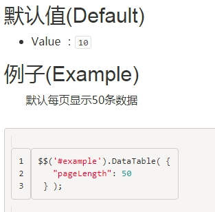

# **一、** ***\*D\*******\*atatables官网地址\****

中文

http://www.datatables.club/reference/option/

英文

https://www.datatables.net/reference/index

 

英文网的资料更多些。

一些属性用法可以在这里搜索

 

 

# **二、** ***\*项目中的应用\****

在我们的查询分页页面，基本就用到了datatables组件

如用户查询userList.html

除去引入css和js，我们做下简单的使用介绍

## **1.** ***\*定义table的id\****

 

## **2.** ***\*定义function\****

 

 

这里进入页面我们默认执行以下这个方法，就是打开就进行查询数据。

 

这里是搜索按钮做了一个click绑定。

# **三、** ***\*参数说明\****

如这些都是参数

## **1.** ***\*serverSide\*******\*开启服务端分页\****

这个参数为true是开启服务端分页，为true之后，发起请求的话，会带上参数start和length，start是开始位置，从0开始，length是每页数量，默认为10

## **2.** ***\*每页默认条数\****

| [pageLength](http://www.datatables.club/reference/option/pageLength.html) | 改变初始化页长度（每页多少条数据） |
| ------------------------------------------------------------ | ---------------------------------- |
|                                                              |                                    |

 

 

## **3.** ***\*排序\****

| [ordering](http://www.datatables.club/reference/option/ordering.html) | 是否允许Datatables开启排序 |
| ------------------------------------------------------------ | -------------------------- |
|                                                              |                            |

 

 

## **4.** ***\*个别列的排序\****

| [columns.orderable](http://www.datatables.club/reference/option/columns.orderable.html) | 开启/禁用这列是否排序 |
| ------------------------------------------------------------ | --------------------- |
|                                                              |                       |

如我们的操作列

 

这里指定为false，这一列就不能点击进行排序了。

 

## **5.** ***\*查询接口ajax\****

 

### **1)** ***\*url\****

这里url就是我们的接口地址

### **2)** ***\*type\****

可以指定我们是get请求，还是post请求

***\*注意：\****

如果列比较多的话，可能会往服务端发送的参数特别多，这时候get请求已经不行了，需要用post请求，后端改为post接口。

### **3)** ***\*data\****

指定查询参数，如

 

如上图的例子，在data里这样写，访问接口的时候，会发送参数名为username、nickname、status的参数，这里主要是我们自己做查询的时候的一些搜索条件。

## **6.** ***\*D\*******\*atatables数据返回格式\****

首先ajax返回的数据要是json格式的，最起码要有数据总数量，和数据集合列表。

### **1)** ***\*默认返回数据格式\****

 

默认要有这三个字段，

其中data是数据集合，

recordsTotal是用来计算总页数的，如下图

 

recordsFiltered用来做下图的显示

 

### **2)** ***\*修改返回数据格式\****

如果我们没按照datatables默认的数据返回格式返回，如我们返回的是

 

那么datatables默认是不能解析的，我们可以用参数dataSrc

 

顾名思义，dataSrc就是数据源，这里的参数json其实datatables就是根据他的数据来渲染表格的，我们将total赋值给recordsTotal和recordsFiltered，然后呢，把数据集合return,datatabls就是根据这个结果来渲染数据。

 

## **7.** ***\*数据\*******\*渲染\****

### **1)** ***\*columns\****

通过columns字段进行数据渲染，如下

这里columns集合里的元素个数，需要跟

 

这里头的个数一样，其实就是一个th对应一个{ "data": "username", "defaultContent": ""},这种格式的数据。

### **2)** ***\*data\****

 

如上图，data里的username对应json里的username，这一列将根据json里username的值进行显示。

### **3)** ***\*render\****

操作列因为不跟某个字段直接对应，

这里用render进行处理，参数row就是那一行的json数据，你也可以用data指定具体那个数据，如下图

 

1里写成"data": "status"，那么2的data的值就是json里key为status的对应的值