# **一、** ***\*下载\*******\*地址\****

https://www.elastic.co/cn/downloads

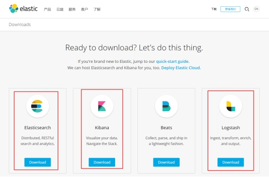 

# **二、** ***\*E\*******\*lasticsearch\*******\*下载安装运行\****

## **1.** ***\*W\*******\*indows上安装\****

### **1)** ***\*先\*******\*下载\****

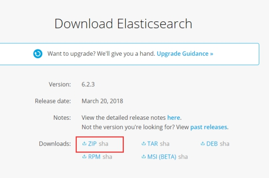 

### **2)** ***\*解压\*******\*后\****

修改配置config\elasticsearch.yml ，参考下图

***\*不存在\*******\*data和logs\*******\*目录\*******\*的话\*******\*，\*******\*先\*******\*创建\*******\*data和logs\*******\*目录\****

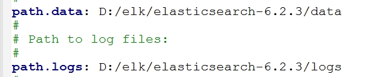 

***\*将\*******\*path.data\*******\*和\*******\*path.log\*******\*改为\*******\*你电脑上的路径\****

### **3)** ***\*运行\****

双击

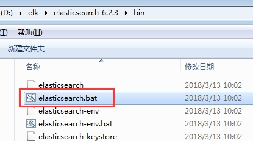 

等控制台有输出后

访问http://localhost:9200/

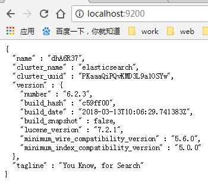 

出来这个结果说明安装成功

 

# **三、** ***\*K\*******\*i\*******\*b\*******\*ana\****

## **1.** ***\*W\*******\*indows\*******\*上安装\****

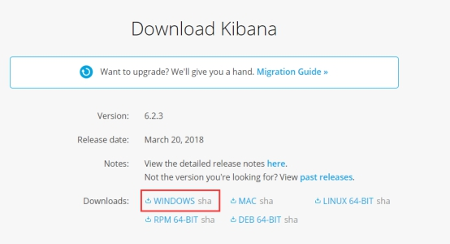 

解压后，双击

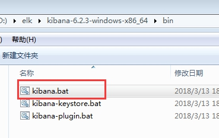 

访问http://localhost:5601

出来界面即为成功

# **四、** ***\*logstash\****

下载

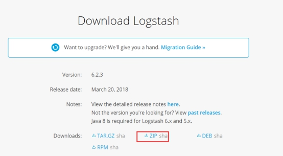 

### **1)** ***\*logstash.conf\****

解压后，在bin目录下创建logstash.conf文件，并贴入下面的input、output等，并将红色的改为你自己的路径

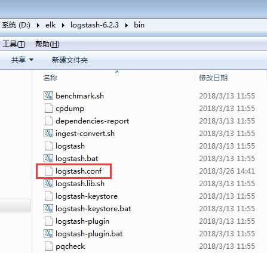 

input{

​	file {

​		path => ["E:/idea-space/cloud-service/logs/user-center.log"]

​		type => "user-center"

​	}

​	file {

​		path => ["E:/idea-space/cloud-service/logs/manage-backend.log"]

​		type => "manage-backend"

​	}

​	file {

​		path => ["E:/idea-space/cloud-service/logs/file-center.log"]

​		type => "file-center"

​	}

​	file {

​		path => ["E:/idea-space/cloud-service/logs/gateway-zuul.log"]

​		type => "gateway-zuul"

​	}

​	file {

​		path => ["E:/idea-space/cloud-service/logs/log-center.log"]

​		type => "log-center"

​	}

​	file {

​		path => ["E:/idea-space/cloud-service/logs/oauth-center.log"]

​		type => "oauth-center"

​	}

​	file {

​		path => ["E:/idea-space/cloud-service/logs/notification-center.log"]

​		type => "notification-center"

​	}

 

}

 

output{

 

​	if [type] == "user-center" {

​		elasticsearch {

​			hosts => ["localhost"]

​			index => "user-center"		

​		}

​	}

​	if [type] == "manage-backend" {

​		elasticsearch {

​			hosts => ["localhost"]

​			index => "manage-backend"		

​		}

​	}

​	if [type] == "file-center" {

​		elasticsearch {

​			hosts => ["localhost"]

​			index => "file-center"		

​		}

​	}

​	if [type] == "gateway-zuul" {

​		elasticsearch {

​			hosts => ["localhost"]

​			index => "gateway-zuul"		

​		}

​	}

​	if [type] == "log-center" {

​		elasticsearch {

​			hosts => ["localhost"]

​			index => "log-center"		

​		}

​	}

​	if [type] == "oauth-center" {

​		elasticsearch {

​			hosts => ["localhost"]

​			index => "oauth-center"		

​		}

​	}

​	if [type] == "notification-center" {

​		elasticsearch {

​			hosts => ["localhost"]

​			index => "notification-center"		

​		}

​	}

}

### **2)** ***\*制作启动\*******\*脚本\****

在bin目录下创建run.bat文件里面贴入

logstash.bat -f logstash.conf

启动时，双加run.bat即可

报错的话，看看你的环境变量CLASSPATH，是不是有什么c:\Program Files (x86)\QuickTime\QTSystem\QTJava.zip

删除这个，然后重启电脑，再试试

### 3) Create index ***\*pattern\****

访问http://localhost:5601

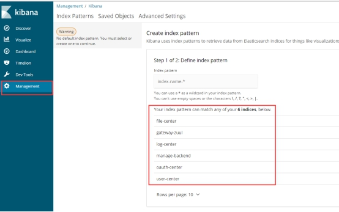 

选择左侧菜单Management

右侧显示我们的各个服务名，***\*注意，这里要求logstash.conf\*******\*里面\*******\*配置的日志文件路径正确，并且存在日志文件，否则\*******\*不会\*******\*出现\*******\*上图\*******\*右侧\*******\*的\*******\*列表\****。

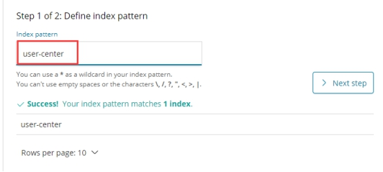 

输入名字，最好跟我们的服务名一致，这样一一对应，大家更好查看是哪个服务的日志，这里以user-center为例，然后点击Next step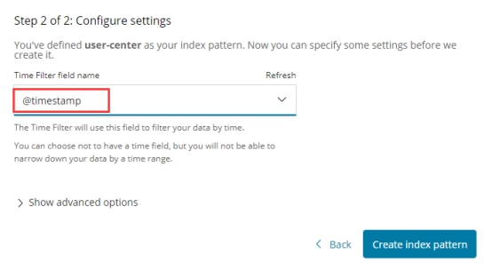

选择@timestamp，然后点击Create index pattern

然后依次，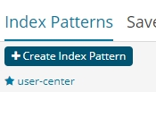创建别的服务的日志索引。

### **4)** ***\*查看\*******\*日志\****

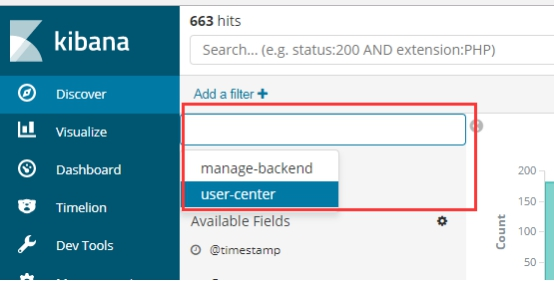 

左侧菜单选择

然后选择你的日志索引名，即可查看日志了

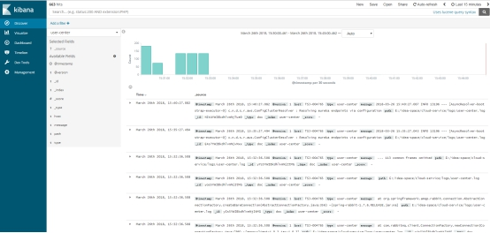 

右上角可以选择时间维度，具体用法大家可自行摸索。