# **一、** ***\*Z\*******\*ipkin下载\****

## **1.** ***\*官网\****

https://zipkin.io/

## **2.** ***\*下载\****

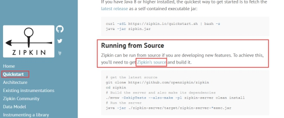 

https://github.com/openzipkin/zipkin

这是zipkin官方源码的github地址

打开这个网址，往下翻，

在Quick-start里面，点击一下latest released server，如下图

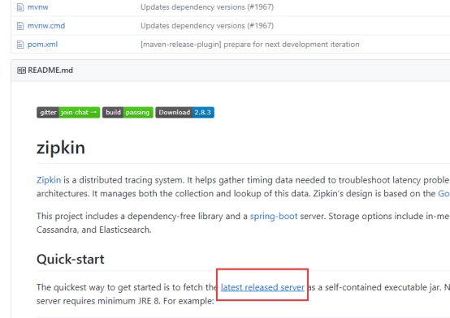 

点击后，将会下载一个可执行的jar，可理解为就像我们的spring boot项目打成的jar

 

# **二、** ***\*运行zipkin\****

Zipkin支持内存、mysql、elasticsearch等存储数据，采用一种方式运行即可，以下将简单说明运行方式

***\*如上章节下载的jar文件名为\*******\*zipkin-server-2.8.3-exec.jar,\*******\*目前\*******\*这是最新版本，以后可能\*******\*版本\*******\*会升级，\*******\*自行\*******\*下载最新版即可，\*******\*以下内容将以该文件名为例\****

## **1.** ***\*内存InMom\*******\*ory\*******\*存储数据\****

Zipkin默认采用内存存储数据，重启后数据就没了，而且内存存储数量有限

***\*启动命令\****

java –jar zipkin-server-2.8.3-exec.jar

默认端口号为9411

http://localhost:9411

如要指定端口号，用参数QUERY_PORT，详细解读看下视频

java -jar zipkin-server-2.8.3-exec.jar --QUERY_PORT=9411

 

## **2.** ***\*数据库mysql存储数据\****

首先要初始化一些表，默认库名zipkin，建表语句在文档目录，文件名05 zipkin.sql

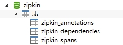 

***\*启动命令\****

java -jar zipkin-server-2.8.3-exec.jar --QUERY_PORT=9411 --STORAGE_TYPE=mysql --MYSQL_HOST=localhost --MYSQL_TCP_PORT=3306 --MYSQL_USER=root --MYSQL_PASS=root --MYSQL_DB=zipkin

 

数据库ip、端口号、用户名、密码、库名等都可以指定，智慧如你，相信一眼就能识别出是哪个配置了。

如zipkin端口号是参数QUERY_PORT来指定

Mysql端口号参数是MYSQL_TCP_PORT来指定

库名参数是MYSQL_DB来指定

详细看视频

## **3.** ***\*E\*******\*lasticsearch存储数据\****

Es存储的话，只需要用启动命令即可

首先你要启动了elasticsearch，不要犯这种低级错哦

***\*启动命令\****

java -jar zipkin-server-2.8.3-exec.jar --QUERY_PORT=9411 --STORAGE_TYPE=elasticsearch --ES_HOSTS=http://localhost:9200 --ES_INDEX=zipkin

索引名参数是ES_INDEX来指定

测试发现，实际index，并不是zipkin，而是zipkin:span-2018-05-12，应该是按日期分index了

# **三、** ***\*代码里配置zipkin\****

## **1.** ***\*P\*******\*om添加依赖\****

在我们需要使用zipkin跟踪的项目里添加zipkin依赖

如用户系统、授权系统、网关系统、后台管理系统、通知系统、文件系统、日志系统等

***\**<\**\******\**dependency\**\******\**>\**\******\**
\**\***  ***\**<\**\******\**groupId\**\******\**>\**\***org.springframework.cloud***\**</\**\******\**groupId\**\******\**>\**\******\**
\**\***  ***\**<\**\******\**artifactId\**\******\**>\**\***spring-cloud-starter-zipkin***\**</\**\******\**artifactId\**\******\**>\**\******\**
\**\***  ***\**<\**\******\**version\**\******\**>\**\***${starter-zipkin.version}***\**</\**\******\**version\**\******\**>\**\******\**
\**\******\**</\**\******\**dependency\**\******\**>\**\***

版本号在父pom里统一定义

 

## **2.** ***\*配置zipkin地址\****

如我们启动的zipkin端口号是9411

地址是http://localhost:9411

我们需要在用到zipkin的项目里配置这个地址

spring.zipkin. base-url=http://localhost:9411

如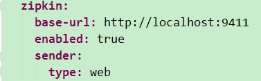

我们的源码里已配置好

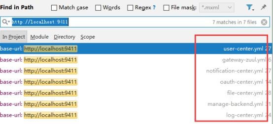 

## **3.** ***\*统计比率设置\****

Zipkin默认是只收集0.1比率的数据的，这个参数可以修改，是由客户端调用者自己来设置的，这里注意下，不是zipkin服务端，是客户端，如用户系统

参数是spring.sleuth.sampler.percentage=0.1

源码类是

org.springframework.cloud.sleuth.sampler.SamplerProperties

这个参数我们源码里没有配置，将默认采用0.1，

如要修改的话，你可自行添加该参数到配置文件里，如下图

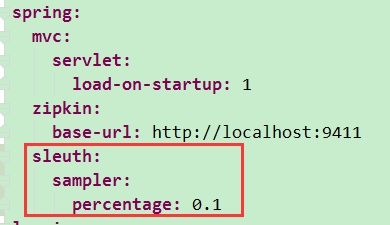 

取值范围是0-1

如改成1的话，将收集全部请求

# **四、** ***\*Z\*******\*ipkin\*******\*源码配置\*******\*文件\*******\*地址\****

https://github.com/openzipkin/zipkin/blob/master/zipkin-server/src/main/resources/zipkin-server-shared.yml

其实运行时，指定的参数都是从这个源码配置里查到的，如端口号参数QUERY_PORT

 

如mysql参数

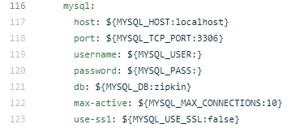 

如elasticsearch参数

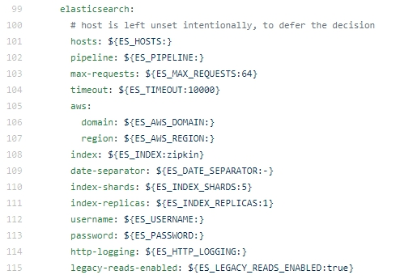 

# **五、** ***\*Z\*******\*ipkin\*******\*数据收集方式\****

看了源码的配置文件之后，可以发现默认是http的方式收集数据的

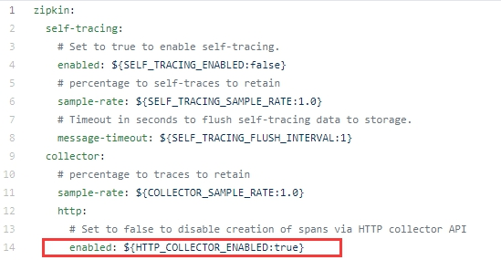 

我们以上的配置和运行也是基于发送http请求的

## **1.** ***\*http\*******\*方式收集\****

运行zipkin的服务zipkin-server-2.8.3-exec.jar参数命令，如第二章节的一样，

我们的各个微服务客户端的参数是

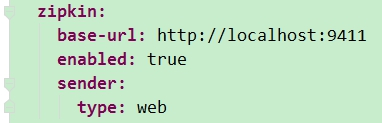 

以上章节已经说明，这里不再过多说。

 

## **2.** ***\*Rabbitmq的\*******\*方式\*******\*收集\****

### **1)** ***\*Z\*******\*ipkin\*******\*服务端参数变动\****

运行zipkin的服务zipkin-server-2.8.3-exec.jar参数命令，需要添加mq的参数，注意***\*参数间不要有换行符\****，否则相当于回车键，就运行了

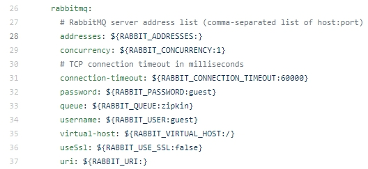 

Mq地址

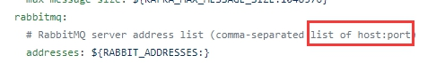 

-- RABBIT_ADDRESSES=localhost:5672

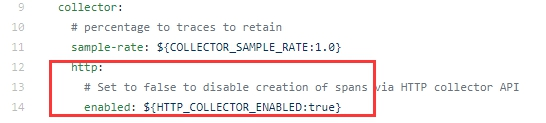 

该参数要注入false

 

我们以mq用户名cloud-dev密码cloud-dev

Virtual host为/举例

如内存存储

java -jar zipkin-server-2.8.3-exec.jar --QUERY_PORT=9411 --HTTP_COLLECTOR_ENABLED=false --RABBIT_ADDRESSES=localhost:5672 --RABBIT_USER=cloud-dev --RABBIT_PASSWORD=cloud-dev --RABBIT_VIRTUAL_HOST=/

 

mysql存储

java -jar zipkin-server-2.8.3-exec.jar --QUERY_PORT=9411 --STORAGE_TYPE=mysql --MYSQL_HOST=localhost --MYSQL_TCP_PORT=3306 --MYSQL_USER=root --MYSQL_PASS=root --MYSQL_DB=zipkin --HTTP_COLLECTOR_ENABLED=false --RABBIT_ADDRESSES=localhost:5672 --RABBIT_USER=cloud-dev --RABBIT_PASSWORD=cloud-dev --RABBIT_VIRTUAL_HOST=/

 

elasticsearch存储

java -jar zipkin-server-2.8.3-exec.jar --QUERY_PORT=9411 --STORAGE_TYPE=elasticsearch --ES_HOSTS=http://localhost:9200 --ES_INDEX=zipkin --HTTP_COLLECTOR_ENABLED=false --RABBIT_ADDRESSES=localhost:5672 --RABBIT_USER=cloud-dev --RABBIT_PASSWORD=cloud-dev --RABBIT_VIRTUAL_HOST=/

 

其实就是在第二章的参数基础上加上

--HTTP_COLLECTOR_ENABLED=false --RABBIT_ADDRESSES=localhost:5672 --RABBIT_USER=cloud-dev --RABBIT_PASSWORD=cloud-dev --RABBIT_VIRTUAL_HOST=/

### **2)** ***\*客户端\*******\*参数修改\****

首先，客户端要添加rabbitmq依赖，我们的微服务gateway-zuul和oauth-center暂时未添加mq依赖，需要在这两个服务的pom文件里添加依赖

***\**<\**\******\**dependency\**\******\**>\**\******\**
\**\***  ***\**<\**\******\**groupId\**\******\**>\**\***org.springframework.boot***\**</\**\******\**groupId\**\******\**>\**\******\**
\**\***  ***\**<\**\******\**artifactId\**\******\**>\**\***spring-boot-starter-amqp***\**</\**\******\**artifactId\**\******\**>\**\******\**
\**\******\**</\**\******\**dependency\**\******\**>\**\***

 

别的服务因为引入了log-stater，log-stater里已经引入了rabbitmq，因此别的服务pom不需要改动。

还有就是配置参数需要修改，我们默认的在配置中心，各个微服务里

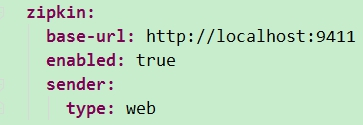 

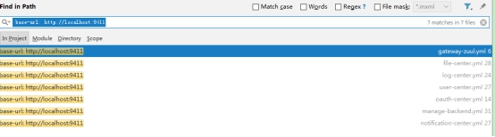 

***\*需要\*******\*修改\*******\*成\****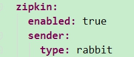

***\*即\*******\*去掉了http\*******\*方式\*******\*的url\*******\*，同时\*******\*把\*******\*sender\**** ***\*type\*******\*改为\*******\*rabbit\****

源码请看

org.springframework.cloud.sleuth.zipkin2.sender.ZipkinSenderProperties

 

 

 