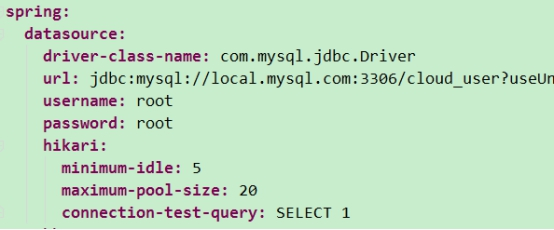
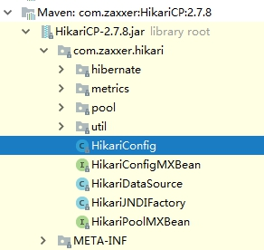
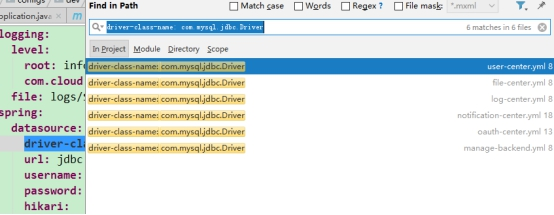
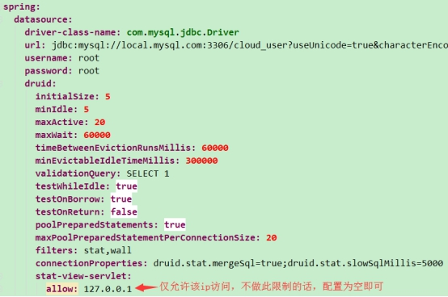
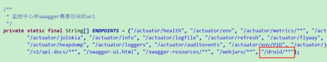

# **一、** ***\*默认\*******\*连接池\****

Spring boot2 默认用的数据源连接池是hikari，我也没怎么听过，想了解更多的话，百度关键词 ***\*spring boot2 hikari\****

我们拿用户中心举例，别的服务也一样道理

如user-center.yml，看下图，

 

里面配置了连接池的信息，这里只是配置了几个参数，更多的参数可看下源码配置类com.zaxxer.hikari.HikariConfig

下图是该类所在的jar包

 

该类的成员变量就是参数，驼峰和中划线效果相同

 

# **二、** ***\*切换为\*******\*druid\*******\*连接池\****

## **1.** ***\*P\*******\*om中添加druid依赖\****

首先为我们的微服务添加druid的pom依赖，只给用到数据库的微服务添加即可，如用户服务、认证中心、管理后台、文件中心、通知中心、日志中心

***\**<\**\******\**dependency\**\******\**>\**\******\**
\**\***  ***\**<\**\******\**groupId\**\******\**>\**\***com.alibaba***\**</\**\******\**groupId\**\******\**>\**\******\**
\**\***  ***\**<\**\******\**artifactId\**\******\**>\**\***druid-spring-boot-starter***\**</\**\******\**artifactId\**\******\**>\**\******\**
\**\***  ***\**<\**\******\**version\**\******\**>\**\***1.1.9***\**</\**\******\**version\**\******\**>\**\******\**
\**\******\**</\**\******\**dependency\**\******\**>\**\***

## **2.** ***\*修改配置文件\****

修改配置，添加druid的配置，主要是连接池的配置参数，可全局搜下，如搜索

***\*driver-class-name:\**** com.mysql.jdbc.Driver

如下图

 

主要是这上面搜索到的几个文件里涉及到了数据库的配置，

将我们的数据库配置改为下图，图下面第三节我提供了可复制的参数，复制后注意下格式，我们是yml格式的，主要注意层次关系

 

## **3.** ***\*复制参数\****

druid:
 initialSize: 5
 minIdle: 5
 maxActive: 20
 maxWait: 60000
 timeBetweenEvictionRunsMillis: 60000
 minEvictableIdleTimeMillis: 300000
 validationQuery: SELECT 1
 testWhileIdle: true
 testOnBorrow: true
 testOnReturn: false
 poolPreparedStatements: true
 maxPoolPreparedStatementPerConnectionSize: 20
 filters: stat,wall
 connectionProperties: druid.stat.mergeSql=true;druid.stat.slowSqlMillis=5000
 stat-view-servlet:
  allow: 127.0.0.1

 

## **4.** ***\*修改Per\*******\*mitAllUrl\****

 

在这个类里加上“/druid/**”，如下图

 

这里主要是druid提供了界面，我们要放开这个权限，访问的话，这里就要单个服务单独访问了，

比如用户中心ip和端口号是localhost:7777

那访问链接就是http:// localhost:7777/druid/

 

 

 