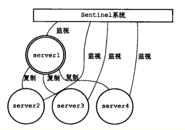

**一、** ***\*R\*******\*edis下载\****

我们以windows环境为例，下载地址

https://github.com/MicrosoftArchive/redis/releases

 

Zip的免安装版，下载解压即可，解压之后如下图

 

# **二、** ***\*管理\*******\*工具\*******\*下载\****

https://redisdesktop.com/download

该款工具名叫RedisDesktopManager

这里有windows、也有mac等，根据需要下载即可

# **三、** ***\*单机\*******\*模式\****

 

如使用默认配置，直接双击上图红色exe即可，

如是linux环境的话，命令应该也是redis-server

默认端口是6379，默认是没有密码的，默认只能本机连接访问，因为默认是绑定了127.0.0.1

***\*以下\*******\*章节将介绍，修改端口、密码、允许远程访问\****

# **四、** ***\*端口号\*******\*修改\****

打开配置文件redis.windows.conf，如下图

 

打开该文件，找到下图红色的地方，这里写的6379就是端口号

 

将6379改为你想要的端口号，

然后在该文件夹下创建一个文件，如名为run6379.cmd，如下图

 

在文件6379.cmd里写入一行命令

***\*redis-server redis.windows.conf\****

如下图，即这个文件就是我们的新的启动脚本了

 

以后启动，直接双击这个启动脚本即可，出现下图即可，红色的是你指定的端口号

 

# **五、** ***\*设置\*******\*密码\****

一般开发环境我们很少设置密码，生产一般会设置密码，

同样是redis.windows.conf文件，搜索requirepass找到下图

 

这里是被注释掉的

例如我们改成下图，那么密码就是aaaa

 

同样启动命名用redis-server redis.windows.conf

# **六、** ***\*允许远程\*******\*访问\****

同样是redis.windows.conf文件，搜索bind 127.0.0.1

 

把这行注释掉，如下图

 

同样启动命名用redis-server redis.windows.conf

# **七、** ***\*高可用\*******\*步骤一\****

该步骤是启动多台redis服务，一主多从

## **1.** ***\*启动\*******\*master\****

用启动命名redis-server redis.windows.conf启动一个redis实例，该实例比如端口是6379，那么这个实例就是我们的master了

## **2.** ***\*配置\*******\*slave\****

复制一份redis.windows.conf，比如重命名为redis.windows.conf-6479

修改redis.windows.conf-6479里的端口号，改为6479

并且找到

 

在该行下写入

slaveof 127.0.0.1 6379

请注意空格，如下图

 

顾名思义，意思就是该6479实例，是主机127.0.0.1下6379实例的从属

改了这两处配置之后，启动该从的实例，命名如下

redis-server redis.windows.conf-6479

如下图，说明配置成功

 

依照上述步骤，我们可以再复制 redis.windows.conf-6479，命名为redis.windows.conf-6579，并修改redis.windows.conf-6579里的端口改为6579，并用启动命名redis-server redis.windows.conf-6579启动6579的实例，这样就成了一主多从的模式

## **3.** ***\*验证\*******\*主\*******\*从\*******\*是否生效\****

用工具连接上这三个实例，比如我们在6379的主添加一个key，看下6479和6579两个从是否有同样的key生成，还有就是在6379的主删除一个key或者修改一个key，看两个从是否同步删除或更新。

# **八、** ***\*高可用步骤\*******\*二\****

## **1.** ***\*配置\*******\*哨兵\****

新建文件

sentinel.conf-26379

sentinel.conf-26479

sentinel.conf-26579

分别写入以下5行配置，注意端口号分别是26379、26479、26579

别的一样

port 26379

sentinel monitor mymaster 127.0.0.1 6379 2

sentinel down-after-milliseconds mymaster 60000

sentinel failover-timeout mymaster 180000

sentinel parallel-syncs mymaster 1

 

配置说明：

\1. port :当前Sentinel服务运行的端口

\2. sentinel monitor mymaster 127.0.0.1 6379 2

Sentinel去监视一个名为mymaster的主redis实例，这个主实例的IP地址为本机地址127.0.0.1，端口号为6379，而将这个主实例判断为失效至少需要2个 Sentinel进程的同意，只要同意Sentinel的数量不达标，自动failover就不会执行

\3. sentinel down-after-milliseconds mymaster 60000

指定了Sentinel认为Redis实例已经失效所需的毫秒数。当实例超过该时间没有返回PING，或者直接返回错误，那么Sentinel将这个实例标记为主观下线。只有一个 Sentinel进程将实例标记为主观下线并不一定会引起实例的自动故障迁移：只有在足够数量的Sentinel都将一个实例标记为主观下线之后，实例才会被标记为客观下线，这时自动故障迁移才会执行

\5. sentinel failover-timeout mymaster 180000如果在该时间（ms）内未能完成failover操作，则认为该failover失败

\4. sentinel parallel-syncs mymaster 1

指定了在执行故障转移时，最多可以有多少个从Redis实例在同步新的主实例，在从实例较多的情况下这个数字越小，同步的时间越长，完成故障转移所需的时间就越长

## **2.** ***\*启动\*******\*三个哨兵\****

命令是

redis-server sentinel.conf-26379 –sentinel

redis-server sentinel.conf-26479 –sentinel

redis-server sentinel.conf-26579 –sentinel

 

## **3.** ***\*哨兵\*******\*大致的原理图\****

 

 

意思大致就是主实例挂了之后，会将一个从实例提升为主实例，从而实现高可用

# **九、** ***\*项目\*******\*中redis配置修改\****

默认单实例配置，如下图

 

哨兵模式，配置如下图

 

其中spring.redis.sentinel.master=mymaster

这个值mymaster是第八章第1节配置哨兵的时候，那几行配置里起的名字

# **十、** ***\*参考\****

http://bbs.redis.cn/forum.php?mod=viewthread&tid=715

http://redisdoc.com/topic/sentinel.html

https://www.cnblogs.com/LiZhiW/p/4851631.html

本文基本是windows环境的讲解，linux基本套路也差不多，就是启动参数加配置文件

建议：配置好了之后，尽量都做成启动脚本，直接启动脚本即可，这样更方便，脚本制作也很简单，参考第四章，windows做成.cmd文件即可，linux做成.sh文件

 

 

 

 

 

 